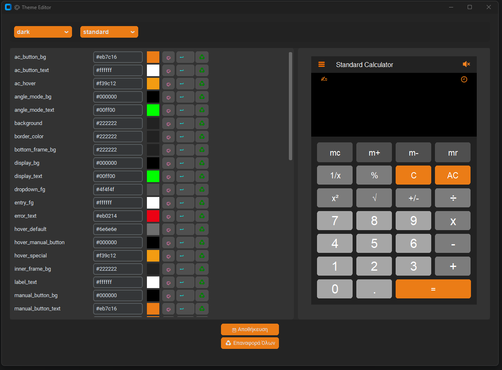

# Theme Matrix: Εργαλείο Προσαρμογής Θεμάτων για MultiCalculator

Το "Theme Matrix" είναι ένα αυτόνομο εργαλείο γραφικού περιβάλλοντος (GUI) σχεδιασμένο αποκλειστικά για την εύκολη προσαρμογή και διαχείριση των οπτικών θεμάτων του **MultiCalculator** – ενός project αριθμομηχανής πολλαπλών λειτουργιών που αναπτύχθηκε για το Ελληνικό Ανοικτό Πανεπιστήμιο (ΕΑΠ). Ως ένα ξεχωριστό project, αυτό το εργαλείο παρέχει μια ισχυρή και διαισθητική διεπαφή για τη δημιουργία, επεξεργασία και αποθήκευση προσαρμοσμένων χρωματικών θεμάτων, τα οποία μπορούν να εφαρμοστούν απρόσκοπτα στην κύρια εφαρμογή του MultiCalculator.

Ο στόχος του Theme Matrix είναι να προσφέρει πλήρη έλεγχο στην εμφάνιση του Calculator, επιτρέποντας στους χρήστες να προσαρμόσουν κάθε χρωματική λεπτομέρεια και να δουν τις αλλαγές σε πραγματικό χρόνο, χωρίς να χρειάζεται να τροποποιήσουν τον κώδικα της κύριας εφαρμογής.

## Χαρακτηριστικά

* **Επεξεργασία Θεμάτων σε Πραγματικό Χρόνο**: Άμεση προβολή των αλλαγών χρωμάτων στην ενσωματωμένη προεπισκόπηση του MultiCalculator.
* **Διαχείριση Θεμάτων μέσω CSV**: Φόρτωση και αποθήκευση πολλαπλών ρυθμίσεων θεμάτων από/προς ένα αρχείο CSV (`themeMatrix.csv`), επιτρέποντας την εύκολη εναλλαγή και αποθήκευση προσαρμοσμένων εμφανίσεων.
* **Εργαλείο Επιλογής Χρωμάτων (Color Picker)**: Εύκολη και διαισθητική επιλογή χρωμάτων μέσω ενός ενσωματωμένου διαλόγου επιλογής χρώματος.
* **Λειτουργίες Αναίρεσης/Επαναφοράς**: Δυνατότητα αναίρεσης μεμονωμένων αλλαγών για συγκεκριμένα πεδία ή επαναφοράς όλων των ρυθμίσεων στις αρχικές τους τιμές για το επιλεγμένο θέμα.
* **Προεπισκόπηση Λειτουργιών Calculator**: Εναλλαγή μεταξύ διαφορετικών λειτουργιών του Calculator (Standard, Scientific, Number Converter, Currency Converter) εντός του παραθύρου προεπισκόπησης, εξασφαλίζοντας πλήρη έλεγχο του θέματος σε όλες τις όψεις της εφαρμογής.
* **Εργαλεία Κειμένου**: Βασικές λειτουργίες αντιγραφής, αποκοπής και επικόλλησης για τα πεδία εισαγωγής τιμών HEX χρωμάτων.
* **Δυναμική Δημιουργία Προεπισκόπησης**: Χρησιμοποιεί το `previewFrameManager.py` για τη δυναμική δημιουργία κλάσεων προεπισκόπησης, εξαλείφοντας την ανάγκη για ξεχωριστά αρχεία preview για κάθε λειτουργία του Calculator.
* **Διαισθητικό UI με Tooltips**: Ενσωματώνει `tooltips` για την παροχή χρήσιμων πληροφοριών κατά την αλληλεπίδραση με τα στοιχεία του εργαλείου.

## Στιγμιότυπα Οθόνης

Εδώ μπορείτε να δείτε ένα στιγμιότυπο του Theme Matrix σε λειτουργία, με το παράθυρο προεπισκόπησης του MultiCalculator:



## Τεχνολογίες

* **Python 3.6+ (Συνιστάται 3.13+)**: Η γλώσσα προγραμματισμού στην οποία είναι γραμμένη η εφαρμογή.
* **CustomTkinter**: Ένα σύγχρονο και προσαρμόσιμο GUI toolkit βασισμένο στο Tkinter, που παρέχει την αισθητική και τη λειτουργικότητα του UI.
* **Tkinter**: Η βασική βιβλιοθήκη για τη δημιουργία GUI σε Python, πάνω στην οποία χτίζεται το CustomTkinter.
* **CSV Module**: Χρησιμοποιείται για την ανάγνωση και εγγραφή δεδομένων θεμάτων από το αρχείο `themeMatrix.csv`.
* **Pillow (PIL Fork)**: Χρησιμοποιείται για τη φόρτωση και διαχείριση εικόνων (π.χ., εικονίδια μενού και ήχου).
* **mpmath**: Παρέχει υποστήριξη για αριθμητική κινητής υποδιαστολής αυξημένης ακρίβειας (28 δεκαδικά ψηφία), απαραίτητη για τους υπολογισμούς στην προεπισκόπηση του Scientific Calculator.
* **pygame**: Χρησιμοποιείται για την προαιρετική αναπαραγωγή ήχων κλικ στην προεπισκόπηση του Calculator.
* **requests**: Απαραίτητο για τη λειτουργία της προεπισκόπησης του Currency Converter, καθώς χρησιμοποιείται για την ανάκτηση ισοτιμιών από εξωτερικό API (απαιτείται σύνδεση στο διαδίκτυο).
* **fractions**: Χρησιμοποιείται για ακριβείς υπολογισμούς με δεκαδικούς αριθμούς στην προεπισκόπηση του Number Base Converter.
* **tkhtmlview**: Χρησιμοποιείται για την εμφάνιση HTML περιεχομένου (εγχειρίδιο χρήσης) εντός του GUI της προεπισκόπησης.

## Γρήγορη Εκκίνηση

Για να ξεκινήσετε με το Theme Matrix:

1.  **Κλωνοποιήστε το αποθετήριο:**
    ```bash
    git clone [https://github.com/YourUsername/your-repo-name.git](https://github.com/YourUsername/your-repo-name.git) # Αντικαταστήστε με το πραγματικό URL του αποθετηρίου σας
    cd your-repo-name
    ```
2.  **Εγκαταστήστε τις απαιτούμενες βιβλιοθήκες:**
    Είναι προτεινόμενο να χρησιμοποιήσετε ένα [virtual environment](https://docs.python.org/3/library/venv.html) για την εγκατάσταση των εξαρτήσεων.
    ```bash
    pip install -r requirements.txt
    ```
    (Το αρχείο `requirements.txt` περιλαμβάνεται στο αποθετήριο).

3.  **Εκτελέστε το Theme Matrix:**
    ```bash
    python themeEditor.py
    ```

## Οδηγίες Χρήσης

### Χρήση του Theme Matrix (`themeEditor.py`)

1.  **Επιλογή Θέματος**: Στην κορυφή του παραθύρου, χρησιμοποιήστε το πρώτο αναπτυσσόμενο μενού (dropdown) για να επιλέξετε το θέμα που θέλετε να επεξεργαστείτε (π.χ., "dark", "light").
2.  **Επιλογή Λειτουργίας Προεπισκόπησης**: Χρησιμοποιήστε το δεύτερο αναπτυσσόμενο μενού για να αλλάξετε τη λειτουργία του Calculator που εμφανίζεται στην προεπισκόπηση (π.χ., "standard", "scientific", "number converter", "currency converter"). Αυτό σας επιτρέπει να δείτε πώς εφαρμόζεται το θέμα σε διαφορετικά μέρη της κύριας εφαρμογής.
3.  **Επεξεργασία Χρωμάτων**:
    * Κάθε γραμμή αντιστοιχεί σε μια ρυθμιστική ιδιότητα (π.χ., `background`, `button_color`).
    * Μπορείτε να πληκτρολογήσετε απευθείας την τιμή του χρώματος σε μορφή HEX (π.χ., `#FF0000` για κόκκινο) στο πεδίο εισαγωγής.
    * Εναλλακτικά, κάντε κλικ στο κουμπί "Επιλογή Χρώματος" (ή το αντίστοιχο εικονίδιο) για να ανοίξει ένας επιλογέας χρώματος και να επιλέξετε οπτικά το χρώμα.
    * Οι αλλαγές θα εμφανίζονται άμεσα στην προεπισκόπηση στα δεξιά.
4.  **Εργαλεία Αναίρεσης / Επαναφοράς**:
    * Κάντε δεξί κλικ σε ένα πεδίο εισαγωγής για επιλογές Copy, Paste, Cut.
    * Το κουμπί "Αναίρεση" (ή το αντίστοιχο εικονίδιο) επαναφέρει την αμέσως προηγούμενη τιμή που είχε το πεδίο.
    * Το κουμπί "Επαναφορά" (ή το αντίστοιχο εικονίδιο) επαναφέρει την αρχική τιμή για τη συγκεκριμένη ιδιότητα του θέματος (όπως φορτώθηκε από το CSV).
5.  **Αποθήκευση Αλλαγών**: Αφού ολοκληρώσετε τις αλλαγές σας, πατήστε το κουμπί "Αποθήκευση" για να αποθηκεύσετε τις ρυθμίσεις του τρέχοντος επιλεγμένου θέματος στο αρχείο `themeMatrix.csv`.
6.  **Επαναφορά Όλων**: Για να επαναφέρετε όλες τις ρυθμίσεις του **επιλεγμένου θέματος** στις αρχικές τους τιμές (όπως ήταν όταν φορτώθηκε το θέμα), πατήστε το κουμπί "Επαναφορά Όλων".

### Προβολή Αλλαγών στον MultiCalculator

Για να δείτε τις αλλαγές του θέματος που αποθηκεύσατε να εφαρμόζονται στην πλήρη εφαρμογή του MultiCalculator (η οποία βρίσκεται σε ξεχωριστό αποθετήριο):

1.  Βεβαιωθείτε ότι έχετε αποθηκεύσει τις αλλαγές σας στο Theme Matrix πατώντας το κουμπί "Αποθήκευση".
2.  Εάν έχετε το αποθετήριο του MultiCalculator, μπορείτε να το εκτελέσετε (`python mainCalc.py`) για να δείτε τα ενημερωμένα θέματα σε πλήρη λειτουργία.

## Δομή Αρχείων

* `themeEditor.py`: Το κύριο script της εφαρμογής Theme Matrix.
* `themeMatrix.csv`: Το αρχείο δεδομένων που περιέχει όλες τις ρυθμίσεις των θεμάτων.
* `themeManager.py`: Διαχειρίζεται τη φόρτωση και παροχή των δεδομένων θεμάτων από το `themeMatrix.csv`.
* `themeMatrixCsvGenerator.py`: Ένα βοηθητικό script για τη δημιουργία ή την αναγέννηση του αρχείου `themeMatrix.csv`.
* `mainCalcPreview.py`: Μια απλοποιημένη έκδοση του `mainCalc.py`, ειδικά προσαρμοσμένη για χρήση ως παράθυρο προεπισκόπησης εντός του `themeEditor.py`.
* `previewFrameManager.py`: Δημιουργεί δυναμικά κλάσεις προεπισκόπησης για κάθε λειτουργία του Calculator, βασιζόμενη στο `frameManager.py`.
* `frameManager.py`: Ορίζει τις διαθέσιμες λειτουργίες (modes) του Calculator και αντιστοιχίζει την κλάση και το εικονίδιο για κάθε μία (π.χ., Standard, Scientific).
* `standardCalc.py`: Υλοποιεί τη λειτουργικότητα του Standard Calculator (χρησιμοποιείται στην προεπισκόπηση).
* `scientificCalc.py`: Υλοποιεί τη λειτουργικότητα του Scientific Calculator (χρησιμοποιείται στην προεπισκόπηση).
* `numberConverter.py`: Υλοποιεί τη λειτουργικότητα του Number Base Converter (χρησιμοποιείται στην προεπισκόπηση).
* `currencyConverter.py`: Υλοποιεί τη λειτουργικότητα του Currency Converter (χρησιμοποιείται στην προεπισκόπηση).
* `buttonHandler.py`: Περιέχει τη λογική χειρισμού των πατημάτων κουμπιών για τους υπολογιστές (χρησιμοποιείται στην προεπισκόπηση).
* `keyboardInputHandler.py`: Διαχειρίζεται την είσοδο από το πληκτρολόγιο και τους hotkeys (χρησιμοποιείται στην προεπισκόπηση).
* `manualHandler.py`: Διαχειρίζεται την εμφάνιση του ενσωματωμένου manual (`manual.html`) στην προεπισκόπηση.
* `historyWindow.py`: Υλοποιεί το παράθυρο ιστορικού πράξεων στην προεπισκόπηση.
* `tooltip.py`: Βασικό module για τη δημιουργία tooltips.
* `tooltipInjector.py`: Εισάγει tooltips σε widgets, χρησιμοποιώντας mappings από το `tooltipMap.py`.
* `tooltipMap.py`: Περιέχει τους χάρτες (mappings) που καθορίζουν το περιεχόμενο των tooltips.
* `manual.html`: Το αρχείο HTML που περιέχει το αναλυτικό εγχειρίδιο χρήσης και τη λίστα των hotkeys (χρησιμοποιείται από την προεπισκόπηση).
* `mainCalc.py`: (Συμπεριλαμβάνεται για αναφορά) Το κύριο script του MultiCalculator, το οποίο χρησιμοποιεί τα θέματα που επεξεργάζονται με το Theme Matrix.
* `images/`: Κατάλογος που περιέχει τα εικονίδια και τα στιγμιότυπα οθόνης που χρησιμοποιούνται στην εφαρμογή και στο README (π.χ., `sound_on.png`, `menu_icon.png`, `themeMatrix_01.png` κ.α.).
* `sounds/`: Κατάλογος που περιέχει τα αρχεία ήχου (π.χ., `space_sound4.mp3`).
* `requirements.txt`: Λίστα με όλες τις απαιτούμενες βιβλιοθήκες Python για εύκολη εγκατάσταση.

## Αντιμετώπιση Προβλημάτων (Troubleshooting)

* **Αρχεία Εικόνων/Ήχου δεν Βρίσκονται**: Εάν λάβετε προειδοποιήσεις ότι αρχεία εικόνων (`.png`) ή ήχου (`.mp3`) δεν βρέθηκαν, βεβαιωθείτε ότι οι φάκελοι `images/` και `sounds/` βρίσκονται στον ίδιο κατάλογο με τα εκτελέσιμα scripts και περιέχουν τα απαραίτητα αρχεία.
* **Ο Μετατροπέας Νομισμάτων στην Προεπισκόπηση δεν Λειτουργεί**: Η λειτουργία "Currency Converter" στην προεπισκόπηση απαιτεί ενεργή σύνδεση στο διαδίκτυο για να ανακτήσει τις τρέχουσες ισοτιμίες από το `exchangerate-api.com`. Βεβαιωθείτε ότι ο υπολογιστής σας είναι συνδεδεμένος στο internet.
* **Ήχος δεν Αναπαράγεται στην Προεπισκόπηση**: Εάν ο ήχος είναι ενεργοποιημένος στην προεπισκόπηση αλλά δεν ακούγεται, βεβαιωθείτε ότι οι drivers ήχου είναι ενημερωμένοι και ότι το `pygame` έχει εγκατασταθεί σωστά. Ορισμένα συστήματα μπορεί να απαιτούν επιπλέον ρυθμίσεις για την αναπαραγωγή ήχου μέσω `pygame`.


## Άδεια Χρήσης

Αυτό το έργο διατίθεται υπό την άδεια MIT. Ανατρέξτε στο αρχείο `LICENSE` για περισσότερες λεπτομέρειες.